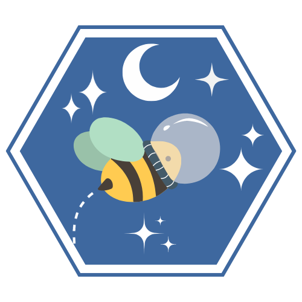

<h1 align="center">Portfólio - Jacqueline Mariane Bezerra </h1>

## Sobre mim
Meu nome é Jacqueline Mariane Bezerra, tenho 25 anos e estou cursando o 5º semestre de Análise e Desenvolvimento de Sistemas na FATEC São José dos Campos - Prof. Jessen Vidal. Minha paixão por tecnologia começou em 2017, quando participei da Semana Nacional de Ciência e Tecnologia (SNCT) no evento "Portas Abertas: A Matemática está em Tudo", onde atuei como apresentadora e desenvolvedora de um aplicativo mobile.

Minha trajetória profissional iniciou em 2018, como estagiária de QA na DIMEP Sistemas. Nessa posição, fui responsável por testar, analisar e validar funcionalidades após o desenvolvimento do produto D-SAT, onde trabalhei até 2020. Atualmente, estou estagiando na Embraer, na área de desenvolvimento de soluções, onde realizo análises de requisitos de software, auxilio na verificação de dados relacionais e não-relacionais, e automatizo ferramentas e KPIs. Além disso, trabalho na otimização de planilhas, sites e sistemas de gestão, prestando suporte aos clientes internos e atuando como interface entre diferentes áreas e equipes.

Minha experiência acadêmica também foi enriquecida por meio da metodologia de Aprendizagem por Projetos Integrados, que me permitiu colaborar com diversas empresas e aplicar os conhecimentos adquiridos em projetos reais, proporcionando uma vivência prática e transformadora.

## Contatos

## Meus Principais Conhecimentos

### Backend
- Python
- Node.js
- Java
- Java FX
- Typescript
- SQL
- Automation Anywhere

### Frontend
- HTML5
- CSS3
- Bootstrap
- Javascript
- React

### Banco de Dados
- MongoDB
- SQL

### Outras Tecnologias
- SharePoint
- Power Platform

 
 
 ## Meus Projetos

  
  
Segundo Semestre (2023-1)

  # API ADS 2º Semestre 
# Software Rendimento Escolar - VAPT

      
      <h2 align="center"> Buzz Tech</h2>
      Programa Desktop em Java que automatiza o controle de atividades avaliativas para professores de uma escola estadual.
  
   Cliente: FATEC São José dos Campos.

  [GitHub do Projeto](https://github.com/BuzzTech-API/API_ADS_2SEMESTRE_2023.1) 
  
  **Tecnologias utilizadas:**
  
  * MySQL
  * Java
  * JavaFX
  * JavaFX Scene Builder

 **Contribuições pessoais:**
  
  Neste projeto, atuei como desenvolvedora e fui responsável por implementar O CRUD (Create, Read, Update, Delete) das entidades do projeto como "Aluno", usando um banco de dados simples (MySQL) e também atuaei na configurações de algumas telas utilizando JavaFX. 
  
  
  **Hard Skills:**
  
  Durante o desenvolvimento desse projeto, exercitei as seguintes hard skills:
  
  * MySQL
  * Java
  * JavaFX
  * JavaFX Scene Builder

**Soft Skills:**

Durante este projeto, desenvolvi importantes soft skills, como <ins>adaptabilidade</ins>, <ins>resiliência</ins> e <ins>trabalho em equipe</ins>. Como foi meu primeiro projeto de API, me integrei a uma equipe já entrosada e com um ritmo estabelecido, o que exigiu flexibilidade para acompanhar o grupo e colaborar de forma eficaz. Essa experiência também fortaleceu minha <ins>comunicação</ins>, permitindo uma troca mais fluida de ideias e alinhamento constante com a equipe.

